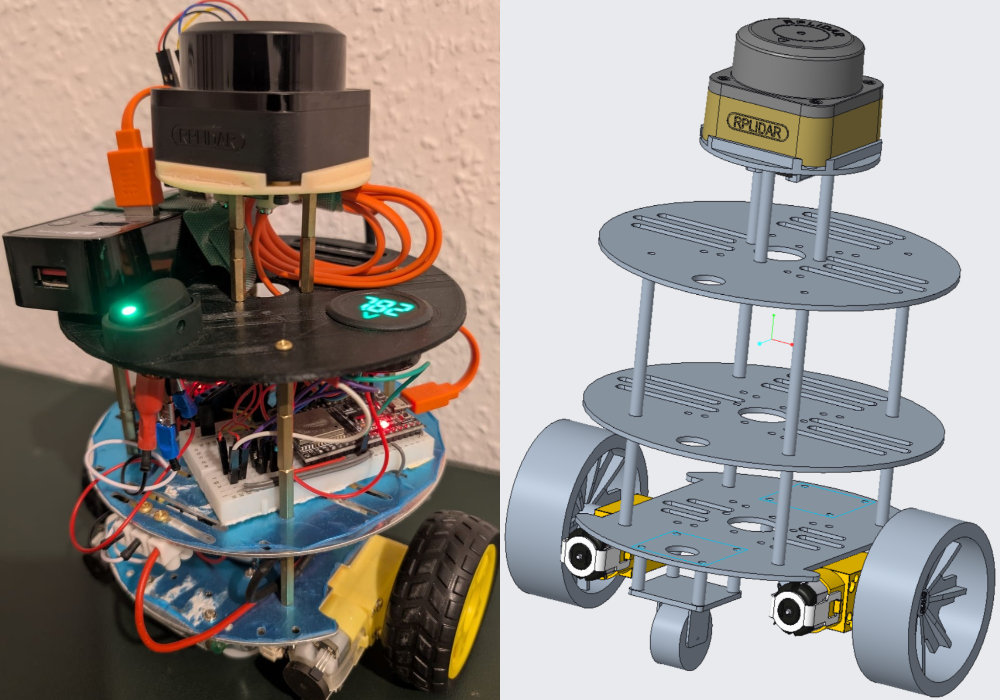
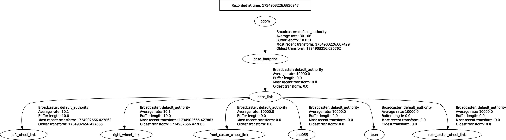

# ROS2 Workspace

A ROS2 workspace that includes multiple packages for controlling, simulating, localizing, and interacting with a mobile robot. Each package is modular and fulfills specific tasks, collectively forming a complete robot platform with differential drive.

## Table of Contents
- [ROS2 Workspace](#ros2-workspace)
  - [Table of Contents](#table-of-contents)
  - [System Architecture](#system-architecture)
  - [Hardwareplattform](#hardwareplattform)
  - [Workspace Overview](#workspace-overview)
    - [1. my\_robot\_description](#1-my_robot_description)
    - [2. MicroROS Bot Projekt](#2-microros-bot-projekt)
    - [3. my\_robot\_control](#3-my_robot_control)
    - [4. my\_robot\_sensors](#4-my_robot_sensors)
    - [5. my\_robot\_localization](#5-my_robot_localization)
    - [7. Hand Gesture Control](#7-hand-gesture-control)
    - [8. web\_based\_control](#8-web_based_control)
  - [Future Work](#future-work)


## System Architecture

The packages work together to form a complete robot platform:

1. **Low-Level Control Layer:** The ESP32 with MicroROS communicates with the motors and encoders. 
2. **Sensor Data Layer:** Sensors (IMU, LiDAR, camera) provide data to ROS2.
3. **Localization Layer:** The `my_robot_localization` package fuses sensor data for precise position estimation.
4. **High-Level Control Layer:** The `my_robot_control` manages and prioritizes commands from various input sources
5. **Interaction Layer:** Hand gesture recognition using OpenCV and MediaPipe enables intuitive control.
6. **Navigation Layer:** The `my_robot_navigation` package enables autonomous navigation.

The software architecture is distributed across two systems: ROS2 (host) was tested on Ubuntu 22.04.5 with the ROS2 Humble distribution, while MicroROS runs on the ESP32 using PlatformIO as the development platform. This separation enables an efficient division between computationally intensive tasks (localization, navigation, image processing) and real-time motor control.

## Hardwareplattform

This workspace was developed for a real, custom-built robot and tested with actual hardware. The robot uses the following sensors and components:

- **Differential drive** with DC motors and Hall-effect encoders
- **BNO055 IMU sensor** for orientation and angular velocity
- **RPliDAR C1** for environment scanning and navigation
- **Webcam** for hand gesture control
- **ESP32** with MicroROS for low-level control


<p align="center">

</p>

## Workspace Overview
Each package in this workspace has its own detailed README file with specific installation instructions, usage examples, and additional documentation. The following is a brief overview of each package.


### 1. [my_robot_description](src/my_robot_description/README.md)

A package that provides the description (URDF/Xacro), visualization, and simulation of a custom robot.

**Key Features:**
- URDF/Xacro-based robot description
- RViz visualization
- Gazebo simulation
- Sensor integration (LiDAR, IMU)


This package includes a technical drawing [technical drawing](src/my_robot_description/technische_zeichnung.pdf), that clearly and comprehensively illustrates the robot's geometry. This drawing provides a detailed overview of the robot's physical structure and supports the creation of URDF/Xacro files.

<p align="center">

</p>
<p align="center">

</p>


### 2. [MicroROS Bot Projekt](src/micorRos_bot/README.md)

A project for controlling a two-wheeled robot using MicroROS with FreeRTOS on the ESP32 with PlatformIO as the development platform. This package replaces the functionality typically provided by `ros2_control` and offers a custom solution for motor control and sensor integration.

**Key Features:**
- Motor control with encoder interrupts and PID regulation
- ROS integration with MicroROS using the DDS communication protocol (Data Distribution Service)
- Publication of odometry, joint states, and transformations

**important Files:**
- [`main.cpp`](src/micorRos_bot/src/main.cpp): Main project logic
- [`MotorController.h`](src/micorRos_bot/include/MotorController.h): Motor control and PID regulation
- [`ros_interface.h`](src/micorRos_bot/include/ros_interface.h): ROS integration


### 3. [my_robot_control](src/my_robot_control/README.md)

A ROS2 package for controlling the robot with various input methods and prioritizing control commands.

<p align="center">

</p>

**Key Features:**
- Robot control via `keyboard` and `joystick`
- Integration with `hand gesture control` and `navigation`
- Emergency stop functionality via `keyboard` and `joystick`
- Twist multiplexing for prioritizing control sources
- Timestamped velocity commands


### 4. [my_robot_sensors](src/my_robot_sensors/README.md)

A ROS2 package that provides several sensors as ROS2 nodes, including support for BNO055 IMU, RPLIDAR, and a camera.

**Key Features:**
- BNO055 IMU: provides orientation, angular velocity, and acceleration data
- RPLIDAR: A 2D laser scanner for mapping and obstacle detection
- Camera: Captures and publishes image data for vision-based applications
    - supports Image and CompressedImage message formats


### 5. [my_robot_localization](src/my_robot_localization/README.md)

A package for localizing a mobile robot local using Kalman Filters (KF) & Extended Kalman Filters (EKF) and global using Adaptive Monte Carlo Localization (AMCL)

<p align="center">
  

  <em>Disturbance test: Robot maintains localization accuracy while being lifted and manipulated, demonstrating the robustness of EKF-based sensor fusion</em>
</p>

**Key Features:**
- Sensor fusion with wheel odometry and IMU data
- Custom implementation of a Kalman Filter and use of the Extended Kalman Filter from the [robot_localization](https://github.com/cra-ros-pkg/robot_localization) package
- Simple tools for evaluating and visualizing localization performance
- Real-time processing of sensor data


~~### 6. [my_robot_navigation](src/my_robot_navigation/README.md)~~

~~A ROS2 package for robot navigation using Nav2.~~ 
~~This package is currently under development~~

~~**Key Features:**~~
~~- Integration with the Nav2 framework~~
~~- Map creation using the SLAM toolbox~~
~~- Setting and following navigation goals~~
~~- Use of 2D-LiDAR data for navigation~~


### 7. [Hand Gesture Control](src/hand_gesture_control/README.md)

A package that enables robot control through hand gestures using OpenCV and MediaPipe.

<p align="center">
  

  <em>Demo: Hand gesture control in action (the apparent delay is due to video editing, not actual system latency)</em>
</p>

**Key Features:**
- Real-time hand gesture recognition
- Robot control through gestures (e.g., forward, backward, left, right, stop)
- Support for Twist and TwistStamped message formats


### 8. [web_based_control](https://github.com/majdros/web_based_control/blob/main/README.md)

A React-based web dashboard for controlling and monitoring ROS2-enabled robots via a web interface with WebSocket integration.

> **Note:** This package is included as a Git submodule in the workspace.
> To initialize and update the submodule after cloning the repository:
> ```bash
> git submodule update --init --recursive
> ```

<p align="center">
  
</p>

<p align="center">
  
</p>

**Key Features:**
- Real-time robot control via a virtual joystick
- Live camera stream from the robot
- Robot state monitoring (linear and angular velocity)
- WebSocket communication with `rosbridge_server`

**Usage:**
1. Start the `rosbridge_server`:
```bash
  ros2 launch rosbridge_server rosbridge_websocket_launch.xml
```

1. Start the React app in the browser:
```bash
  cd src/web_based_control
  NODE_OPTIONS=--openssl-legacy-provider npm start
```

## Future Work

1. [] **PCB Design for the Robot's Hardware**  
  Currently, the robot's hardware is based on a prototype wiring and 3D-printed frame. A custom PCB design (Printed Circuit Board) will simplify maintenance and optimize component integration.

2. [X] **Web-Based Teleoperation**
  Develop a web-based interface for remote control and monitoring of the robot. This will include real-time video streaming from the robot's camera and the ability to control the robot's movement remotely.

3. [] **Object Tracker & Follower**
  Develop an object tracker that allows the robot to follow a specific object in real-time using both YOLO and  color segmentation.
  This feature will use computer vision to detect and track the object and integrate it with the robot's motion control system.