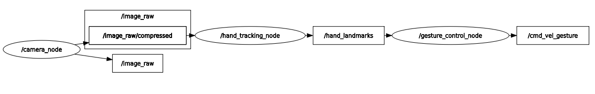

# Hand Gesture Control ROS2 Package

A ROS2 package that enables robot control through hand gestures using computer vision and MediaPipe hand tracking.


## Overview

This package implements real-time hand gesture recognition to control a robot using:
- OpenCV for image processing
- MediaPipe for hand landmark detection
- ROS2 for robot control integration
- Custom message types for hand landmark data
- Gesture mapping:
   ```
   0 fingers: Forward   (linear.x = 1.1, angular.z  = 0.0)
   1 finger: Forward    (linear.x = 1.1, angular.z  = 0.0)
   2 fingers: backward  (linear.x = -1.1, angular.z = 0.0)
   3 fingers: Left      (linear.x = 0.0, angular.z  = 1.7)
   4 fingers: Right     (linear.x = 0.0, angular.z  = -1.7)
   5 fingers: Stop      (linear.x = 0.0, angular.z  = 0.0)
   ```
## Usage

1. Launch:
```bash
# Launch with default settings
ros2 launch hand_gesture_control hand_gesture_control.launch.py

# Launch without Visualization and twist_stamper 
ros2 launch hand_gesture_control hand_gesture_control.launch.py draw_enabled:=false use_twist_stamper:=false
```

2. Available Launch Parameters:

| Parameter                | Description                                      | Default Value     |
|--------------------------|--------------------------------------------------|-------------------|
| `use_twist_stamper`      | Enables/disables the twist_stamper node         | `true`            |
| `twist_stamper_frame_id` | Frame ID for TwistStamped messages              | `''` (empty string) |
| `draw_enabled`           | Enables/disables hand tracking visualization    | `true`            |

3. Run individual nodes:
```bash
ros2 run hand_gesture_control camera_node
ros2 run hand_gesture_control hand_tracking_node
ros2 run hand_gesture_control gesture_control_node
ros2 run hand_gesture_control twist_stamper_node
```

## Velocity Command Flexibility

This project supports two formats for speed commands::

1. **Standard Twist Messages** (`geometry_msgs/Twist`)
   - Topic: `/cmd_vel`
   - Used for robot control without time stamping
   - Issued by `gesture_control_node`

2. **Timestamped Twist Messages** (`geometry_msgs/TwistStamped`)
   - Topic: `/cmd_vel_stamped`
   - Includes additional timestamp information for more precise motion control
   - Issued by `twist_stamper_node`
   - Required for integration with the MicroROS-Bot

The choice between these formats depends on the configuration and requirements of the controlled robot. The MicroROS-Bot uses TwistStamped messages by default for more precise timing control and synchronization.

You can disable the `twist_stamper_node` using the `use_twist_stamper` launch argument


## Package Structure

```bash
hand_gesture_control/
├── CMakeLists.txt
├── package.xml
├── setup.py
├── README.md
├── scripts/
│   ├── camera_node.py
│   ├── hand_tracking_node.py
│   ├── gesture_control_node.py
│   ├── twist_stamper.py
│   └── HandTrackingModule.py
├── msg/
│   ├── HandLandmark.msg
│   └── HandLandmarks.msg
└── launch/
    └── gesture_control.launch.py
└── images/
    └── rosgraph.png
```
## Components

### Topics


- `/image_raw` (sensor_msgs/Image)
- `/hand_landmarks` (hand_gesture_control/HandLandmarks)
- `/cmd_vel` (geometry_msgs/Twist)
- `/cmd_vel_stamped` (geometry_msgs/TwistStamped)

### Nodes

1. **camera_node**
   - Captures video feed from camera
   - Publishes image data to `/image_raw` topic
   - Parameters:
     - `camera_index` (int, default: 0): Camera device index
     - `frame_rate` (float, default: 30.0): Camera frame rate

2. **hand_tracking_node**
   - Subscribes to `/image_raw`
   - Uses MediaPipe for hand landmark detection
   - Publishes hand landmarks to `/hand_landmarks`
   - Parameters:
     - `draw_enabled` (bool, default: True): Enable visualization
     - `max_hands` (int, default: 1): Maximum number of hands to detect
     - `detection_confidence` (float, default: 0.9)
     - `tracking_confidence` (float, default: 0.9)

3. **gesture_control_node**
   - Subscribes to `/hand_landmarks`
   - Converts hand gestures to robot commands
   - Publishes Twist messages to `/cmd_vel`
   - Generates the `Gesture mapping`

4. **twist_stamper_node**
   - Converts Twist to TwistStamped messages
   - Publishes TwistStamped messages to `/cmd_vel_stamped`
   - Parameters:
     - `twist_stamper_frame_id` (string, default: ''): Frame ID for TwistStamped messages

### Custom Messages

#### HandLandmark.msg
```
uint8 id      # Landmark identifier (0-20)
int32 x       # x coordinate in pixels
int32 y       # y coordinate in pixels
```

#### HandLandmarks.msg
```
HandLandmark[] landmarks  # Array of hand landmarks
```
