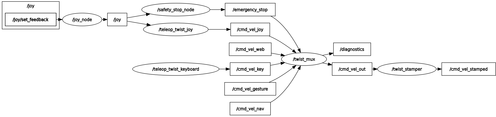

# Control ROS2 Package
A ROS2 package for controlling the robot using various input methods such as joystick and keyboard, with twist multiplexing for prioritized control.


## Overview
This package provides:
- Robot control via keyboard using `teleop_twist_keyboard`
- Robot control via joystick using `teleop_twist_joy`
- Integration with control command from the custom ros2-pkg `hand_gesture_control`
- Integration with navigation command from `nav2`
- Twist multiplexing to prioritize control sources from various inputs


## Usage
1. **Launch with default settings:**
```bash
ros2 launch my_robot_control my_robot_control.launch.py
```

2. **Launch with joystick and keyboard control:**
```bash
ros2 launch my_robot_control my_robot_control.launch.py use_teleop_joy:=true
```

3. **Launch with specified paramters:**
```bash
# Launch with custom frame_id for TwistStamped messages
ros2 launch my_robot_control my_robot_control.launch.py twist_stamper_frame_id:=...
```
3. **Available Launch Parameters:**

| Parameter                | Description                                      | Default Value     |
|--------------------------|--------------------------------------------------|-------------------|
| `use_teleop_keyboard`      | Enables/disables keyboard control         | `true`            |
| `use_teleop_joy` | Enables/disables joystick control              | `false` |
| `use_twist_stamper`      | Enables/disables the twist_stamper node         | `true`            |
| `twist_stamper_frame_id`           | 	Frame ID for TwistStamped message   | `base_link`            |


## Twist Multiplexing
The package uses `twist_mux` to prioritize control commands from different sources. The priority order is:
1. Keyboard control - `priority` : `100`
2. Joystick control - `priority` : `80`
3. the custom ros2-package hand_gesture_control - `priority` : `60`
4. nav2 - `priority` : `40`

Priority levels and timeouts can be configured in `config/twist_mux.yaml`.



## Package Structure
my_robot_control/
├── CMakeLists.txt
├── package.xml
├── setup.py
├── README.md
├── images/
│   ├── rosgraph.py
├── launch/
│   ├── my_robot_control.launch.py
│   └── teleop_twist_keyboard.launch.py
└── config/
    ├── joystick.yaml
    └── twist_mux.yaml

## Components

### Topics


`/cmd_vel_joy` (geometry_msgs/Twist)
`/cmd_vel_key` (geometry_msgs/Twist)
`/cmd_vel_nav` (geometry_msgs/Twist)
`/cmd_vel_gesture` (geometry_msgs/Twist)
`/cmd_vel_out` (geometry_msgs/Twist) - Output from twist_mux
`/cmd_vel_stamped` (geometry_msgs/TwistStamped) - Timestamped output


### Nodes
1. **joy_node**
Reads data from joystick hardware

2. **teleop_node**
Converts joystick inputs to Twist messages
Publishes to `/cmd_vel_joy`

3. **teleop_twist_keyboard**
Enables keyboard control
Publishes to `/cmd_vel_key`

1. **twist_mux**
Multiplexes Twist messages from multiple sources
Prioritizes control inputs based on configuration
Publishes to `/cmd_vel_out`

1. **twist_stamper**
Converts Twist to TwistStamped messages
Adds frame_id and timestamp
Publishes to `/cmd_vel_stamped`

## Dependencies
This package relies on:

- `joy` - For joystick input
- `teleop_twist_joy` - For joystick teleop
- `teleop_twist_keyboard` - For keyboard teleop
- `twist_mux` - For multiplexing control inputs
- `twist_stamper` - For adding timestamps to Twist messages