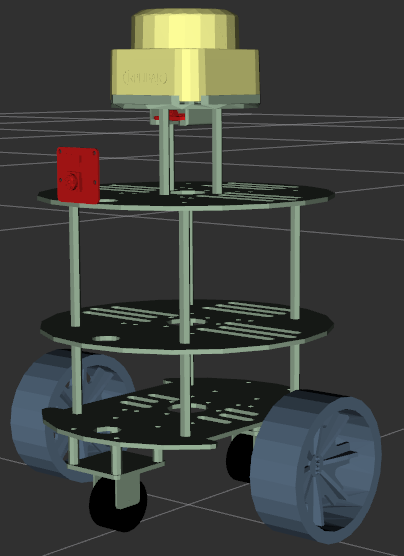
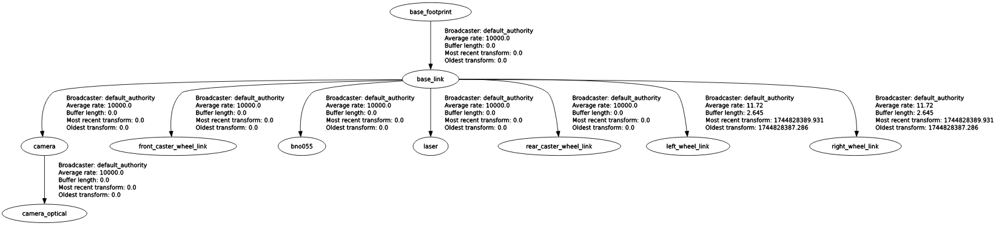

# my_robot_description

A ROS2 package containing the description (URDF/Xacro), visualization, and simulation components for a custom robot platform.


## Overview

This package provides:

- Robot model description using URDF/Xacro
- Launch files for visualization in RViz
- Launch files for simulation in Gazebo

<p align="center">

</p>
<p align="center">

</p>

## Usage
  1. Launch

- Launch mit default setting
```bash
ros2 launch my_robot_description my_robot_description.launch.py
```
- Launch with Gazebo simulation
```bash
ros2 launch my_robot_description my_robot_description.launch.py use_gazebo:=true
```

  2. Available Launch Parameters

| Parameter                | Description                                      | Default Value     |
|--------------------------|--------------------------------------------------|-------------------|
| `use_gazebo`             | Enables/disables  Gazebo simulation              | `false`           |

## Package Structure

```yaml
└── 📁my_robot_description
    └── 📁config
        └── gazebo_params.yaml
        └── my_robot_description.rviz
        └── my_robot.rviz
        └── gazebo.world
    └── 📁images
        └── frames.png
        └── gz-ros-connection.png
        └── my_robot_comp.png
        └── my_robot.png
    └── 📁launch
        └── my_robot_description.launch.py
    └── 📁models
        └── 📁meshes
            └── adafruit_bno055_stemma_qt_1.stl
            └── c1m1_appearance_v2_20230926_3d_.stl
            └── caster_wheel.stl
            └── circo-base-scaled.stl
            └── my_robot_base.stl
            └── wheel.stl
            └── cam_v2_1_v1.stl
        └── model.config
        └── my_robot_model.sdf            

    └── 📁urdf
        └── common_properties.xacro
        └── imu.xacro
        └── lidar.xacro
        └── camera.xacro
        └── my_robot_base_mesh.urdf
        └── my_robot_base_mesh.xacro    # Main robot description
        └── my_robot_base.xacro         # robot description without meshes
        └── my_robot.urdf.xacro
    └── CMakeLists.txt
    └── package.xml
    └── README.md
    └── technische_zeichnung.pdf        # Technical construction details of the robot
```


## Dependencies

This package relies on:

- [robot_state_publisher](https://github.com/ros/robot_state_publisher)
- [joint_state_publisher](https://github.com/ros/joint_state_publisher)
- [xacro](http://wiki.ros.org/xacro)
- [gazebo_ros](https://github.com/ros-simulation/gazebo_ros_pkgs)


## ToDo
[] Update Gazebo classic (EOL) to Ignition/Gazebo


