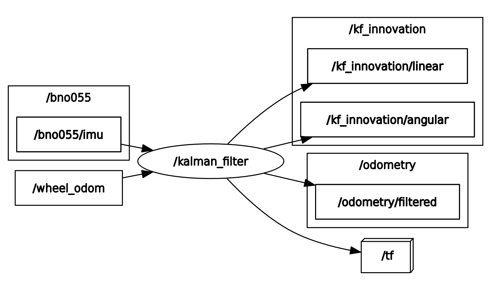
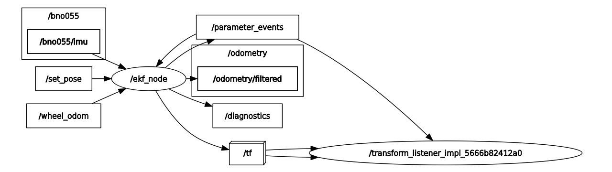

# Localization ROS2 Package
A ROS2 package that implements robot localization systems using a custom implementation of Kalman Filter (KF) and the robot_localization package for the Extended Kalman Filter (EKF) on a custom-built physical mobile robot platform with real hardware sensors.

## Overview

This package was developed and tested on a custom-built physical robot with the following hardware:
- Differential drive base with DC motors
- Hall effect wheel encoders for odometry
- BNO055 IMU sensor for orientation and angular velocity


All tests and evaluations were conducted on real hardware, not in simulation, providing practical insights into performance under real-world conditions.

This package provides:

- Advanced sensor fusion for accurate robot localization
- Integration with wheel odometry and IMU data
- wheel odometry using wheel encoders with Hall effect sensors
- IMU using BNO055 sensor
- Multiple filtering implementations (Kalman Filter, Extended Kalman Filter)
- Simple velocity comparison node
- Simple innovation evaluator node 

<p align="center">
  

  <em>Disturbance test: Robot maintains localization accuracy while being lifted and manipulated, demonstrating the robustness of EKF-based sensor fusion</em>
</p>

## Usage
1. **Launch the Extended Kalman Filter**
```bash
ros2 launch my_robot_localization local_localization.launch.py
```
2. **Run the Kalman Filter**
```bash
ros2 run my_robot_localization kalman_filter.py
```
3. **Run the Simple Velocity Comparison Node**
```bash
ros2 run my_robot_localization velocity_comparison_node.py
```
4. **Run the Simple Innovation Evaluator Node**
```bash
ros2 run my_robot_localization innovation_evaluator.py
```


## Evaluation
This package provides comparison tools for different localization methods:
- `velocity_comparison_node.py`: Compares velocity estimates from different sources
- `innovation_evaluator.py`: Analyzes filter innovation for performance assessment
- `ROS2 bag files`: The evaluation of the implemented filter's performance was conducted using several test scenarios:
    - `stillstand_test`: Robot in stationary state
    - `gerade_test`:  Robot moving forward and backward along the x-axis
    - `kurvenfahrt_test`: Robot rotating in place around its z-axis
    - `Störungstest`: Robot being lifted during a curved movement (disturbance test)


## Package Structure
```yaml
└── 📁my_robot_localization
    └── 📁config
        └── ekf.yaml
        └── kf.rviz
    └── 📁figures
        └── Pipeline_Kalman_Filter.png
        └── Pipeline_Extended_Kalman_Filter.png
        └── Pipeline_Software.png
        └── disturbance-test.gif
    └── 📁launch
        └── local_localization.launch.py
    └── 📁my_robot_localization
        └── __init__.py
        └── innovation_evaluator.py
        └── kalman_filter.py
        └── velocity_comparison_node.py
    └── CMakeLists.txt
    └── package.xml
    └── README.md
    └── 📁include
```

## Components

### Nodes
1. **KF**
   - Implements a custom Kalman Filter for sensor fusion
   - Fuses wheel odometry with IMU data for improved state estimation
   - Provides filtered linear and angular velocities
   - Features:
     - State vector: [linear velocity (vx), angular velocity (ω)]
     - Dynamic measurement noise adaptation based on innovation
     - Dynamic process noise adaptation based on motion rate
     - TF transform broadcasting from odom to base_footprint
     - Innovation publishing for monitoring filter performance

The filter employs standard Kalman Filter equations:

- Prediction: 

<p align="center">
<code>x̂<sub>k|k-1</sub> = A·x̂<sub>k-1|k-1</sub> + B·u<sub>k-1|k-1</sub></code>
</p>

- Uncertainty Propagation:

$$P_{k|k-1} = A \cdot P_{k-1|k-1} \cdot A^T + Q$$

- Innovation:

$$y_k = z_k - H \cdot \hat{x}_{k|k-1}$$

- Kalman Gain:

$$K_k = P_{k|k-1} \cdot H^T \cdot (H \cdot P_{k|k-1} \cdot H^T + R)^{-1}$$

- Update:

<p align="center">
<code>x̂<sub>k|k</sub> = x̂<sub>k|k-1</sub> + K<sub>k</sub>·y<sub>k</sub></code>
</p>


- Uncertainty Update:

$$P_{k|k} = (I - K_k \cdot H) \cdot P_{k|k-1}$$




2. **EKF**
    - Uses the robot_localization package's Extended Kalman Filter
    - Handles non-linear motion models
    - Supports configurable sensor inputs and weights





3. **velocity_comparison_node** 
    - Compares velocity estimates from different sources (wheel odometry, IMU, filtered output)
    - Generates visualization data using `matplotlib` for performance analysis

4. **innovation_evaluator**
    - Helps identify sensor noise characteristics
    - Generates visualization data using `matplotlib` for performance analysis
    - Analyzes innovation, defined as the difference between actual measurement and predicted measurement:
        - When value is zero: Perfect prediction, model matches reality
        - When value is positive: Measurement is higher than prediction, possible underestimation
        - When value is negative: Measurement is lower than prediction, possible overestimation

5. **bno055_node**
    - The node is included from the custom ROS2-pkg `my_robot_sensors` and launched using the `bno055.launch.py`

### Topics

**Inputs:**
- **/wheel_odom** (nav_msgs/Odometry)
- **/bno055/imu** (sensor_msgs/Imu)

**Outputs:**
- **/odometry/filtered** (nav_msgs/Odometry)
- **/kf_innovation/linear** (std_msgs/Float32)
- **/kf_innovation/angular** (std_msgs/Float32)
- **/tf** (tf2_msgs/TFMessage)


## Dependencies
This package relies on:
- [robot_localization](https://github.com/cra-ros-pkg/robot_localization) for EKF implementation
- [my_robot_sensors](https://github.com/majdros/desktop_ros2_ws/blob/main/src/my_robot_sensors/launch/bno055.launch.py) for IMU sensor integration
- [nav_msgs](https://docs.ros.org/en/noetic/api/nav_msgs/html/index-msg.html) for odometry messages
- [sensor_msgs](https://docs.ros2.org/latest/api/sensor_msgs/index-msg.html) for IMU data
- [geometry_msgs](https://docs.ros2.org/latest/api/geometry_msgs/index-msg.html) for pose and transform data
- [tf2](https://ros2-industrial-workshop.readthedocs.io/en/latest/_source/navigation/ROS2-TF2.html) and [tf2_ros](https://docs.ros.org/en/humble/Tutorials/Intermediate/Tf2/Tf2-Main.html) for coordinate transformations
- [tf_transformations](https://docs.ros.org/en/humble/Tutorials/Intermediate/Tf2/Quaternion-Fundamentals.html) for quaternion operations
- [matplotlib](https://matplotlib.org/) for data visualization
- [numpy](https://numpy.org/) for numerical operations 