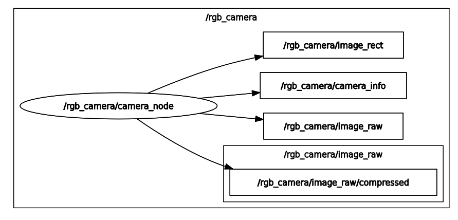

# my_robot_sensors ROS2 Package

A ROS2 package that provides several sensors as ROS2 nodes, including support for BNO055 IMU, RPLIDAR, and a camera.

## Overview

This package integrates multiple sensors into a modular ROS2 framework. It provides launch files and nodes for:
- **BNO055 IMU**: A motion sensor for orientation and acceleration data.
- **RPLIDAR**: A 2D laser scanner for mapping and obstacle detection.
- **Camera**: A node for capturing and publishing image data.

The package is designed to be modular, scalable, and easy to integrate into other ROS2 projects.

## Package Structure

```bash
└── 📁my_robot_sensors
    └── LICENSE
    └── 📁config
        └── bno055_params.yaml
        └── rplidar_params.yaml
        └── web_cam.yaml
        └── usb_cam.yaml
    └── 📁launch
        └── bno055.launch.py
        └── camera.launch.py
        └── rplidar.launch.py
    └── 📁my_robot_sensors
        └── __init__.py
        └── bno055_node.py
        └── camera_node.py
    └── 📁images
        ├── camera_node_graph.png
        ├── image_raw vs image_rect.png
    └── package.xml
    └── README.md
    └── setup.cfg
    └── setup.py
```


## Usage
1. Launch:

<details>
<summary>Click to expand launch options</summary>

- Launch the camera with default settings
```bash
ros2 launch my_robot_sensors camera.launch.py
```

- Launch the camera with custom settings: 
    Example: Set `frame_rate` to 60, `camera_index` to 1 and set `jpeg_quality_value` to 100:

```bash
ros2 launch my_robot_sensors camera.launch.py frame_rate:=60 camera_index:=1 jpeg_quality_value:=100
```

- Launch the IMU sensor:
```bash
ros2 launch my_robot_sensors bno055.launch.py
```

- Launch the LiDAR sensor:
```bash
ros2 launch my_robot_sensors rplidar.launch.py
```
</details>

2. Available Launch Parameters:
<details>
<summary>Click to expand parameter tables</summary>

| Parameter                | Description                                      | Default Value     |
|--------------------------|--------------------------------------------------|-------------------|
| `camera_index` | sets camera device index | `0` (integer)|
| `frame_rate` | sets camera frame rate | `30.0` (float)|
| `use_raw_image_publisher` | Enables/disables the publisher for raw images         | `true` |
| `use_compressed_image_publisher` | Enables/disables the publisher for compressed images | `true` |
| `jpeg_quality_value`      | sets the quality value of JPEG for encoding the Image | `70` (integer)|
| `camera_calibration_file` | camera calibration yaml file | `web_cam.yaml` (string)|

</details>

3. Run individual nodes:

```bash
ros2 run my_robot_sensors camera_node
ros2 run my_robot_sensors bno055
```

## Components

### Topics
1. **Camera Node**
- `/rgb_camera/image_raw` (sensor_msgs/Image)
- `/rgb_camera/image_rect` (sensor_msgs/Image)
- `/rgb_camera/image_info` (sensor_msgs/CameraInfo)
- `/rgb_camera/image_raw/compressed` (sensor_msgs/CompressedImage)

2. **BNO055 Node**
- `/bno055/imu` (sensor_msgs/Imu)
- `/bno055/temp` (sensor_msgs/Temperature)
- `/bno055/calib_status` (std_msgs/String): Publishes calibration status.

3. **RPLIDAR Node**
- `scan`(sensor_msgs/LaserScan)

### Nodes

1. **camera_node**
    - Captures video feed from the camera.
    - Publishes image data to `/rgb_camera/image_raw`, `/rgb_camera/image_raw/compressed`, `/rgb_camera/image_info` and `/rgb_camera/image_rect`.
    - Parameters:
        - `camera_index` (int, default: 0)
        - `frame_rate` (float, default: 30.0)
        - `jpeg_quality_value` (int, default: 70)
        - `use_raw_image_publisher` (bool, default: True)
        - `use_compressed_image_publisher` (bool, default: True)
        - `camera_calibration_file` (string, default: web_cam.yaml)

<p align="center">

</p>

1. **bno055_node** 
    - Interfaces with the Bosch BNO055 IMU sensor
    - Publishes IMU, temperature, and calibration status data
    - some Parameters:
        - `uart_port` (string, default: `/dev/imu`)
        - `connection_type` (string, default: `uart`): uart or i2c
   - **Note**: The parameters for this node such as `uart_port` can be modified in the corresponding YAML file: [bno055_params](./config/bno055_params.yaml)

2. **rplidar_node** 
    - interface with the RPLIDAR sensor
    - publishes laser scan date to `/scan`
    - some parameter:
        - serial_port (string, default: `/dev/rplidar`): Serial port for the RPLIDAR
        - frame_id (string, default: `laser`): Frame ID for the laser scan
        - flip_x_axis: (bool, default: `True`): True if the LIDAR Data is flipped in X axis
   - **Note**: The parameters for this node such as `serial_port` can be modified in the corresponding YAML file: [rplidar_params](./config/rplidar_params.yaml) 


## License
- This repository contains code under multiple licenses. See the [LICENSE](./LICENSE) file for details.
- The file `bno055_node.py` and the file `bno055_params.yaml` are licensed under the [BSD](https://opensource.org/license/BSD-3-Clause) License. See the files for details.
- Other files in this Package are licensed under the [Apache 2.0](https://www.apache.org/licenses/LICENSE-2.0) License.