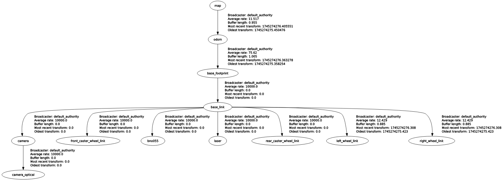

# my_robot_slam_core

A ROS2 package for implementing SLAM (Simultaneous Localization and Mapping) using `slam_toolbox`, with plans to integrate the KISS-ICP algorithm.

---

## Overview

This package provides:
- **Mapping:** Create maps of the environment using LiDAR data.
- **Localization:** Localize the robot in a pre-built map.
- **Integration with Navigation:** Supports integration with the `nav2` stack for autonomous navigation.

---

## Usage

### 1. **Launch**

- **SLAM Mode**

    To create a map of the environment while simultaneously localizing the robot:

    ```bash
    ros2 launch my_robot_slam_core online_async_launch.py
    ```
    - The generated map will be saved using the  `map_saver_server` node from the `nav2_map_server` package with the configuration file `mapping_params_online_async.yaml`
    - During this process, the robot localizes itself in the map while continuously updating the map based on the LiDAR data.


- **Localization Mode**

    To localize the robot with `slam_toolbox` (not yet tested) in a pre-built map, the configuration file `localization_params_online_async.yaml` is required. Changing the launch parameter `slam_params_file` is necessary.
    A global localization has been implemented and tested using `nav2_amcl` im ROS2 package `my_robot_localization`.


### 2. **Available Launch Parameters**

| Parameter                | Description                                      | Default Value     |
|--------------------------|--------------------------------------------------|-------------------|
| `use_sim_time`           | Enables/disables simulation time                 | `false` |
| `use_map_saver`          | Enables/disables `map_saver_server` node         | `false` |
| `slam_params_file`       | Path to the SLAM configuration file              | `my_robot_slam_core/config/mapping_params_online_async.yaml`|

---

## Package Structure
``` bash 
└── 📁my_robot_slam_core
    └── 📁config
        └── localization_params_online_async.yaml
        └── mapping_params_online_async.yaml
    └── 📁images
        └── rosgraph.png
    └── 📁include
        └── 📁my_robot_slam_core
    └── 📁launch
        └── online_async_launch.py
    └── 📁maps
        └── 📁office
            └── map.pgm
            └── map.yaml
        └── 📁office1.0
            └── map.data
            └── map.pgm
            └── map.posegraph
            └── map.yaml
    └── 📁src
    └── CMakeLists.txt
    └── package.xml
    └── README.md
```

---

## Components

### 1. **Topics**
**Inputs**
- `/scan` (`sensor_msgs/LaserScan`): LiDAR data for mapping and localization.

**Outpus**
- `/map` (`nav_msgs/OccupancyGrid`): The generated or loaded map.
- `/tf` (`tf2_msgs/TFMessage`): Transformation between `map`, `odom` and `base_footprint`.


### 2. **Nodes**
1. `async_slam_toolbox_node`
    - Subscribes to `/scan` for LiDAR data
    - provided by the `slam_toolbox` package.

2. `map_saver_server`
    - saves the generated map
    - Provided by the `nav2_map_server` package.

3. `nav2_lifecycle_manager`
    - Manages the lifecycle of the `map_saver_server` node.

4. `rplidar_node `
    - Provides LiDAR data.
    - provided by the `my_robot_sensors` package.


### 3. **Frames**
1. `map_frame: map`
    - Represents the global map frame.
    - map_frame is static and serves as the reference for the entire environment.

2. `odom_frame: odom`
    - Represents the local odometry frame.
    - Tracks the robot's movement over time relative to its starting position.
    - Provided by the `ekf` node in the `my_robot_localization` package.

3. `base_frame: base_footprint`
    - Represents the robot's base frame.
    - base_frame is attached to the physical robot and serves as the reference for all sensors and actuators mounted on the robot.
    - Provided by the `robot_description` in the `my_robot_description` package.


<p align="center">
  
</p>


### 4. **Configuration Files**

1. `mapping_params_online_async.yaml`
   - Configuration for mapping mode.
   - Key parameteres:
    ```yaml
    mode: mapping
    resolution: 0.01    # (1 cm/pixel)
    ```

2. `localization_params_online_async.yaml`
   - Configuration for mapping mode.
   - Key parameteres:
    ```yaml
    mode: localization
    map_file_name: ../maps/office/map.yaml
    ```

---

## Dependencies
- [slam_toolbox](https://github.com/SteveMacenski/slam_toolbox): For SLAM and localization
- [nav2_map_server](https://github.com/ros-navigation/navigation2/tree/main/nav2_map_server): For serving maps
- [nav2_lifecycle_manager](https://github.com/ros-navigation/navigation2/tree/main/nav2_lifecycle_manager): For managing the lifecycle nodes


## ToDo

1. **Implement KISS-ICP:**
   - Integrate the [KISS-ICP](https://github.com/PRBonn/kiss-icp) (Keep It Smale and Simple Iterative Closest Point) algorithm for LiDAR-based SLAM.
   - Compare its performance with `slam_toolbox` using a ROS-Bag to ensure the reuse of identical data for a direct comparison.
   - Use the [Evaluation of Odometry (evo)](https://github.com/MichaelGrupp/evo) package to perform a quantitative comparison with metrics such as Absolute Pose Error (APE), Relative Pose Error (RPE), Root Mean Square Error (RMSE), and Standard Deviation (STD).